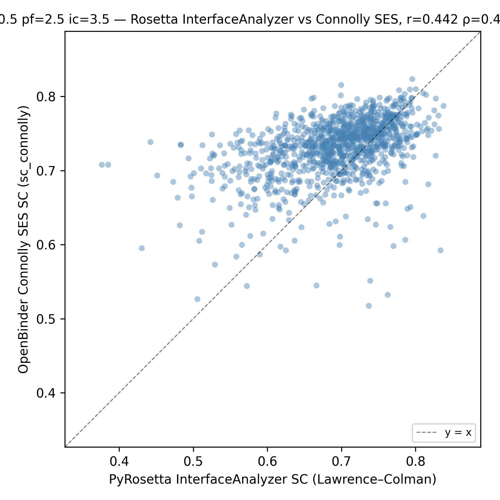

# OpenBinder


**Open-source scoring of AI-generated VHH (nanobody) binders.**

OpenBinder assigns binding-probability scores to VHH nanobody–antigen complexes.
Given candidate structures from an AI design tool such as RFAntibody, BoltzGen, or
IgGM, it helps researchers triage large libraries before committing to wet-lab
validation.

## Key features

- **Fully open-source pipeline** — no PyRosetta, no MSMS, no licensed software
- **Connolly SES shape complementarity** (`scripts/v3/sc_connolly.py`) — grid-based
  Solvent Excluded Surface implementation of Lawrence & Colman (1993), replaces
  closed-source tools
- **RF + MLP models** evaluated by leave-one-out cross-validation (LOO) over 1,129
  antigen stems
- **Best model** (MLP, `both_all`): LOO AUROC 0.9345, AUPRC 0.8642, pass rate 87.9%

> **Use both models together to decide what goes to the wet lab.**
> The RF and MLP fail on different structures. Running them in sequence: RF as a
> high-specificity first pass, MLP to recover borderline cases the RF misses. That cuts
> the candidate library more aggressively than either model alone before committing
> to experimental validation.

## Model performance (LOO)



| Model           | Features | AUROC  | AUPRC  | Pass rate |
|-----------------|--------:|------:|------:|----------:|
| rf_rest         |      95 | 0.9080 | 0.7981 | 86.9%    |
| rf_unrest       |      95 | 0.9039 | 0.7869 | 85.6%    |
| rf_both_raw     |     126 | 0.9127 | 0.8147 | 87.6%    |
| rf_both_delta   |     122 | 0.9287 | 0.8510 | 89.0%    |
| rf_both_all     |     153 | 0.9288 | 0.8501 | 87.9%    |
| **mlp_both_all**| **153** | **0.9345** | **0.8642** | **87.9%** |

Source: `models/loo_results/<config>/pooled_metrics.json`.

## Quick start

**Install:**
```bash
# Recommended: conda (includes OpenMM/PDBFixer for feature extraction)
conda env create -f environment.yml
conda activate openbinder

# Or: pip (sufficient for model training and inference on pre-computed features)
pip install -r requirements.txt
```

**Score a directory of VHH–antigen PDB files:**

```bash
python scripts/v3/score.py \
    --input-dir  /path/to/my_candidates/ \
    --output-dir /path/to/results/ \
    --mode       both \
    --device     auto
```

Output:

```
results/
  scores.csv           ← per-PDB binding probabilities (sorted descending)
  score.log            ← timestamped pipeline log
  intermediates/
    relaxed_rest/      ← restrained-relaxed PDBs
    relaxed_unrest/    ← unrestrained-relaxed PDBs
    features_openmm.csv
    features_cocada.csv
    features_esm.csv
```

`scores.csv` columns: `pdb_name`, `rf_score`, `mlp_score`, `rf_label`,
`mlp_label`. Scores are binding probabilities in [0, 1]; >= 0.5 is
classified as "binder". Rows are sorted by `rf_score` descending (RF is the
documented primary scorer); in `--mode mlp` the sort key is `mlp_score`.

**CLI flags:**

| Flag | Default | Description |
|---|---|---|
| `--input-dir` | required | Directory of `*.pdb` files to score |
| `--output-dir` | required | Root output directory |
| `--mode` | `both` | `rf`, `mlp`, or `both` |
| `--device` | `auto` | `cpu`, `gpu`, or `auto` |
| `--workers` | cpu_count | Parallel workers for relaxation |
| `--skip-relaxation` | off | Skip relaxation if dirs already populated |
| `--vhh-chain` | `H` | Chain ID of the VHH in input PDBs |
| `--esm-checkpoint` | `$ESM_CHECKPOINT` | Path to `esm_ppi_650m_ab.pth` (overrides `$ESM_CHECKPOINT` env var; or use `python scripts/download_assets.py --esm` to download). Download from [Zenodo](https://zenodo.org/records/16909543) |
| `--cocada-path` | `$COCADA_ROOT` | Path to COCaDA repo root (overrides `COCADA_ROOT` env var). Clone from [GitHub](https://github.com/rplemos/COCaDA) |

**ESM step — IgGM dependency:** The ESM step requires the IgGM PPIModel class. Set `PYTHONPATH` to include the IgGM repo root, or download the IgGM source:

```bash
git clone https://github.com/TencentAI4S/IgGM && export PYTHONPATH=$PWD/IgGM:$PYTHONPATH
```

## Dataset

| Quantity | Value |
|---|---|
| Positive complexes | 1,129 |
| Negative complexes | 2,258 (training cohort; 30 held-out files excluded) |
| Total samples | 3,387 |
| LOO folds | 1,129 |

Features: 27 OpenMM interface energetics (restrained + unrestrained), 4 COCaDA
contact counts, 64 ESM-PPI sequence embedding PCA dimensions.

## Repository layout

```
Open-Binder/
├── scripts/v3/         training, LOO harness, inference, sc_connolly.py
├── configs/            one YAML config per model variant
├── data/               pre-computed feature CSVs (~225 MB)
│   └── structures/     full PDB tarballs, ~1.1 GB compressed (Git LFS)
├── models/
│   ├── checkpoints/    trained model artifacts
│   └── loo_results/    per-fold LOO results
├── examples/           example input PDB
└── docs/               supplementary writeups
```

## Data and model weights

Pre-trained model weights and the full structure dataset are hosted on Google Drive:

**[OpenBinder assets on Google Drive](https://drive.google.com/drive/folders/19RSgSMNdrlzEbnTD6olrpnzH6t1JxqVr)**

Download everything automatically:
```bash
python scripts/download_assets.py --weights --structures all
```

Or download only what you need:
```bash
python scripts/download_assets.py --weights                          # model weights only (~137 MB)
python scripts/download_assets.py --esm                              # ESM-PPI checkpoint from Zenodo (~2.4 GB)
python scripts/download_assets.py --structures positives_cleaned     # one tarball (~81 MB)
```

Alternatively, browse the Drive folder and download files manually.
The `weights/` folder contains one file per model; `structures/` contains six tarballs
(see `data/structures/README.md` for the full inventory).

The full per-fold LOO result JSONs (`models/loo_results/`) are also available on
Google Drive for reproducibility. These files are excluded from the git repository due
to size (27 MB, 1,129 per-fold JSON files across 6 configurations); only the pooled
summary files (`pooled_metrics.json`, `pass_rate_by_antigen.csv`) are tracked in git.

## Reproduce training and LOO

### Retrain on the provided dataset

```bash
# Train all RF variants
for cfg in rf_rest rf_unrest rf_both_delta rf_both_raw rf_both_all; do
    python scripts/v3/rf_train.py --config configs/${cfg}.yaml \
        --output-dir models/checkpoints/${cfg}/
done

# Train champion MLP
python scripts/v3/mlp_train.py --config configs/mlp_both_all.yaml \
    --output-dir models/runs/mlp_both_all/

# LOO benchmark — reproduces the results table (all 6 configs, ~4 h)
python scripts/v3/run_loo.py
```

### Train on your own dataset

Prepare two directories of relaxed VHH–antigen PDB files (positives and negatives),
extract features, then train:

```bash
# 1. Extract features for your structures
python scripts/v3/score.py --input-dir /path/to/positives/ \
    --output-dir /tmp/pos_features/ --skip-relaxation
python scripts/v3/score.py --input-dir /path/to/negatives/ \
    --output-dir /tmp/neg_features/ --skip-relaxation

# 2. Edit configs/rf_both_all.yaml to point to your feature CSVs
#    (features_pos, features_neg, features_pos_unrest, features_neg_unrest)

# 3. Train
python scripts/v3/rf_train.py --config configs/rf_both_all.yaml \
    --output-dir models/checkpoints/my_rf/
python scripts/v3/mlp_train.py --config configs/mlp_both_all.yaml \
    --output-dir models/runs/my_mlp/
```

See `BUILD_MANIFEST.md` for the full file-by-file inventory.

## Citation

```bibtex
@article{figueroa2026openbinder,
  title   = {OpenBinder: Predicting Nanobody-Antigen Binding from Interface Energy Decomposition, Interatomic Contacts, and Sequence-Language Features Across Restrained and Unrestrained Relaxation States},
  author  = {Figueroa Rivera, Luis Eduardo and Rojas, Cristian Antonio},
  year    = {2026},
  journal = {TBD}
}
```

See also `CITATION.cff`.

## Contact

Luis Eduardo Figueroa Rivera — luisfigueroa9030@gmail.com | lef.rivera.2021@aluno.unila.edu.br
Cristian Antonio Rojas — cristian.rojas@unila.edu.br

## License

MIT — see `LICENSE`.
